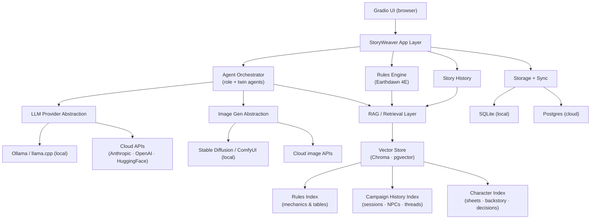

# 🧵 StoryWeaver

> An AI-assisted companion for tabletop role-playing games — starting with **Earthdawn (4th Edition)** and growing into a system-agnostic platform.

StoryWeaver helps players and gamemasters create characters, give every character and NPC an **AI digital twin** for dialogue and behaviour, generate **character and scene imagery**, and keep a living **story history** of the campaign. It is designed to run **locally on your machine** or **in the cloud**, fully dockerized.

> [!IMPORTANT]
> **This document is the source of truth.** StoryWeaver follows *spec-driven development* — the README and the `/specs` directory define intent before code is written. When code and spec disagree, the spec wins. Update this file deliberately; it is the guiding point for all future development.

---

## ⚖️ Disclaimer

StoryWeaver is an **unofficial, fan-made companion tool**. *Earthdawn* is a trademark of **FASA Corporation / FASA Games**, and all related rules, settings, and intellectual property belong to their respective owners. This project:

- Does **not** redistribute copyrighted rulebook text, art, or proprietary content.
- Assumes users own the official rulebooks required to play.
- Implements game *mechanics* as a tool to support legitimate play, not as a replacement for the books.

This is not legal advice. Contributors should keep all bundled game data within fair-use and licensing boundaries.

---

## ✨ Features

### Core (v1 — Earthdawn 4E)
- **Character creation** — guided, rules-aware builder for Earthdawn 4E (Disciplines, Talents, attributes, Karma, etc.).
- **AI digital twins** — each character and NPC gets a persistent agent that helps generate in-character dialogue, behaviour, and suggested actions, grounded in that character's sheet, history, and personality.
- **Character image generation** — portraits from a character's traits and description.
- **Scene image generation** — illustrations of locations and key moments.
- **Story history** — a persistent, queryable timeline of the campaign (sessions, decisions, NPC states, plot threads).

### Planned
- Additional rule systems beyond Earthdawn (system-agnostic core).
- Richer GM tooling (encounter building, initiative, secret notes).
- Cross-device sync between local and cloud play.
- Shared campaign spaces for groups.

---

## 👥 Roles & Agents

StoryWeaver gives **role-specific agents and tools** rather than one generic assistant:

| Role | Focus | Example tools |
|------|-------|---------------|
| **Player** | Their own character(s) | Character builder, personal digital twin, "what would my character do?", private notes |
| **Gamemaster** | The world & NPCs | NPC digital twins, scene generation, hidden lore, story-history authoring, world state |

Each **character/NPC digital twin** is its own scoped agent: it sees only what that entity should know, and exposes a tool set appropriate to it.

---

## 🏗️ Architecture



### Key design decisions

- **Provider-agnostic AI.** A thin abstraction layer wraps all LLM calls. Development starts with **local Ollama**; **cloud APIs (Anthropic, OpenAI, HuggingFace Inference API)** are added later behind the same interface — switchable via configuration, no code changes. **HuggingFace** provides a free-tier Inference API that opens cloud-quality open models (Llama, Mistral, Qwen, etc.) without requiring local GPU hardware.
- **RAG-augmented context.** Three purpose-built retrieval indexes (rules, campaign history, character data) feed relevant chunks into agent prompts, keeping context windows lean and responses grounded in actual game state. See [RAG Architecture](#-rag-architecture) below.
- **Pluggable image generation.** Local (Stable Diffusion / ComfyUI) and cloud backends sit behind one interface; the user chooses per environment.
- **Local-first, cloud-optional data.** SQLite for local play, Postgres for cloud, with a **sync layer** to reconcile player and campaign data across devices.
- **Rules engine is isolated.** Earthdawn 4E lives in its own package so additional systems can be added later without touching the rest of the app.

---

## 🔍 RAG Architecture

StoryWeaver uses **Retrieval-Augmented Generation** to give agents accurate, grounded answers without stuffing the entire game state into every prompt. Three dedicated indexes serve the three main knowledge domains:

### 1. Rules Index — rules checking & validation

> *"Does this character build actually follow the Earthdawn 4E rules?"*

- **What is indexed:** Earthdawn 4E mechanics tables, Discipline progression charts, Talent availability by Circle, attribute step calculations, Karma rules, equipment restrictions, and any structured rules data bundled with the project (no copyrighted prose is redistributed — only distilled facts and references the user's own rulebooks back up).
- **Used by:** the Rules Engine during character creation (validate Talent choices, check Circle prerequisites, compute derived stats) and by digital twins when a player asks "can I do X?".
- **Why RAG instead of hard-code:** the rules surface is large and highly cross-referential; embedding it lets the engine do semantic lookup ("what are the consequences of spending a Recovery Test?") rather than requiring a brittle hand-crafted lookup table for every interaction.

### 2. Campaign History Index — session recall & continuity

> *"What happened with the Ork warband in session 3?"*

- **What is indexed:** session summaries, significant decisions and their outcomes, NPC attitude/state snapshots, active plot threads, locations visited, and items acquired — everything written to the Story History module.
- **Used by:** digital twins (to recall what their character witnessed), GM tooling (to surface related past events when planning scenes), and the narrative assistant (to keep story continuity consistent over long campaigns).
- **Retrieval strategy:** hybrid keyword + semantic search so both proper nouns ("Throal", "Vastrivan") and conceptual queries ("last time we dealt with the Blood Elves") surface the right chunks.

### 3. Character Index — digital twin grounding

> *"My character would know this NPC — how would she react?"*

- **What is indexed:** per-character/NPC records — full character sheet (stats, Talents, equipment), written backstory and personality notes, the character's own in-game decisions and dialogue history, and relationship notes authored by the player or GM.
- **Used by:** the digital twin agent for that character; at inference time the agent retrieves the most relevant chunks of their own record rather than loading the entire sheet into every turn.
- **Isolation:** each character's index is scoped to that entity — a Player's twin cannot query another character's private notes, and an NPC's index is accessible only to the GM agent.

### Embedding & vector store options

| Scope | Local option | Cloud option |
|-------|-------------|--------------|
| Embedding model | `nomic-embed-text` via Ollama | `BAAI/bge-base-en-v1.5` via HuggingFace Inference API (free) |
| Vector store (local) | **ChromaDB** (file-backed) | — |
| Vector store (cloud) | — | **pgvector** extension on Postgres |

The same RAG abstraction layer (`packages/rag/`) wraps both backends — switch via `VECTOR_STORE=chroma` or `VECTOR_STORE=pgvector`.

---

## 🤗 HuggingFace Free Cloud APIs

[HuggingFace Inference API](https://huggingface.co/inference-api) offers a **free tier** that makes cloud-quality open models accessible without a local GPU. StoryWeaver treats it as a first-class LLM provider option.

### Recommended models (free tier)

| Use case | Model | Notes |
|----------|-------|-------|
| Digital twins / dialogue | `mistralai/Mistral-7B-Instruct-v0.3` | Fast, good instruction following |
| Richer twin / GM narration | `meta-llama/Llama-3.1-8B-Instruct` | Gated — requires HF account acceptance |
| Long-context campaign recap | `Qwen/Qwen2.5-7B-Instruct` | 32k context, good at structured output |
| Embeddings (RAG) | `BAAI/bge-base-en-v1.5` | High-quality, free serverless endpoint |

### Free-tier caveats

- Rate limits apply (~10–30 req/min on serverless endpoints); suitable for solo or small-group play, not high-concurrency scenarios.
- Serverless "cold starts" can add 5–20 s latency on the first request after a period of inactivity.
- For sustained throughput, a **Dedicated Endpoint** (paid) or a local Ollama instance is the better path.
- HuggingFace Pro ($9/month) lifts rate limits significantly if the free tier becomes a bottleneck.

---

## 🧰 Tech Stack

| Area | Choice | Notes |
|------|--------|-------|
| Primary language | **Python 3.11+** | Core of the project |
| Performance-critical bits | **Rust / C++ (optional)** | Only where it earns its place (e.g. heavy rules math, image pipelines) |
| UI | **Gradio** | Browser-friendly, minimal front-end effort |
| Service layer (optional) | **FastAPI** | If/when a separate backend API is needed |
| LLM (local) | **Ollama / llama.cpp** | Default for development |
| LLM (cloud) | **Anthropic · OpenAI · HuggingFace Inference API** | Swappable via config; HF free tier requires no GPU |
| Embeddings (local) | **`nomic-embed-text` via Ollama** | |
| Embeddings (cloud) | **`BAAI/bge-base-en-v1.5` via HuggingFace** | Free serverless endpoint |
| Vector store (local) | **ChromaDB** | File-backed, zero-config |
| Vector store (cloud) | **pgvector** (Postgres extension) | Same DB as relational data |
| Image gen (local) | **Stable Diffusion / ComfyUI** | |
| Image gen (cloud) | TBD (e.g. Replicate / hosted APIs) | |
| Agent framework | **TBD** — candidates: Pydantic-AI, LangGraph, or lightweight custom | Decide in a spec before adopting |
| Local DB | **SQLite** | |
| Cloud DB | **Postgres** | |
| Dependency mgmt | **uv** (recommended) or Poetry | Fast, monorepo-friendly |
| Containers | **Docker + Docker Compose** | Local or cloud deployment |
| Testing / eval | **pytest** + custom **harness** | See Harness Engineering below |

---

## 🧪 Development Philosophy

### Spec-Driven Development (SDD)
Intent is captured as written specs **before** implementation. Specs live in `/specs` and are the contract that code must satisfy. Every feature begins with a spec (problem, behaviour, interfaces, acceptance criteria); implementation and review trace back to it.

### Harness Engineering
Because agent behaviour is non-deterministic, StoryWeaver invests in **harnesses** — automated scaffolding that exercises and evaluates agents and tools so behaviour is **measurable, reproducible, and regression-tested**. The `/harness` directory holds eval suites, scenario fixtures, and scoring so we can iterate on prompts/agents with confidence instead of vibes.

### Monorepo
All apps and shared packages live in one repository for atomic changes, shared types, and consistent tooling.

---

## 📁 Repository Layout (proposed)

```
StoryWeaver/
├── apps/
│   ├── web/                  # Gradio UI (browser entry point)
│   └── api/                  # Optional FastAPI service layer
├── packages/
│   ├── core/                 # Shared domain models & types
│   ├── rules_earthdawn/      # Earthdawn 4E rules engine (isolated)
│   ├── agents/               # Role agents + character/NPC digital twins
│   ├── llm/                  # LLM provider abstraction (Ollama → cloud → HuggingFace)
│   ├── imagegen/             # Image generation abstraction (local/cloud)
│   ├── rag/                  # RAG layer: indexes, retrieval, embedding abstraction
│   │   ├── rules/            #   Rules index (mechanics, tables, prerequisites)
│   │   ├── history/          #   Campaign history index (sessions, NPCs, threads)
│   │   └── character/        #   Character index (sheets, backstory, decisions)
│   ├── storage/              # DB models + local↔cloud sync layer
│   └── story/                # Story history / campaign timeline
├── specs/                    # Spec-driven dev: specs as source of truth
├── harness/                  # Eval & test harnesses for agents/tools
├── deploy/
│   ├── docker/               # Dockerfiles
│   └── compose/              # docker-compose for local & cloud
├── docs/                     # Architecture notes, ADRs, guides
├── scripts/                  # Dev & ops scripts
├── pyproject.toml            # Workspace config
└── README.md                 # ← you are here
```

> Native (Rust/C++) modules, when introduced, live under `packages/<name>/native/` with Python bindings, and are optional to build.

---

## 🚀 Getting Started (local development)

> Prerequisites: **Python 3.11+**, **Docker** + **Docker Compose**, and **[Ollama](https://ollama.com)** for local AI.

```bash
# 1. Clone
git clone https://github.com/<your-username>/StoryWeaver.git
cd StoryWeaver

# 2. Set up the environment (uv recommended)
uv sync            # or: poetry install

# 3. Pull a local model for the digital twins
ollama pull llama3.1   # example; pick your preferred local model

# 4. Configure
cp .env.example .env   # then edit values (see Configuration)

# 5. Run the UI
uv run storyweaver web   # launches the Gradio app in your browser
```

For a fully containerized run:

```bash
docker compose -f deploy/compose/docker-compose.local.yml up
```

---

## ⚙️ Configuration

StoryWeaver is configured via environment variables (and/or a `config.yaml`). The AI and image backends are **swappable without code changes**:

```dotenv
# --- LLM provider ---
LLM_PROVIDER=ollama            # ollama | anthropic | openai | huggingface
LLM_MODEL=llama3.1
OLLAMA_BASE_URL=http://localhost:11434
# LLM_API_KEY=...              # Anthropic / OpenAI key
# HF_API_KEY=...               # HuggingFace token (free tier: https://huggingface.co/settings/tokens)
# HF_LLM_MODEL=mistralai/Mistral-7B-Instruct-v0.3

# --- Embeddings ---
EMBED_PROVIDER=ollama          # ollama | huggingface
EMBED_MODEL=nomic-embed-text   # ollama default; HF default: BAAI/bge-base-en-v1.5

# --- RAG / Vector store ---
VECTOR_STORE=chroma            # chroma (local) | pgvector (cloud)
CHROMA_PATH=./data/chroma      # path for local ChromaDB
# PGVECTOR_URL=postgresql://...  # reuses DATABASE_URL if same host

# --- Image generation ---
IMAGE_PROVIDER=local           # local | cloud
IMAGE_LOCAL_BACKEND=comfyui    # comfyui | sd-webui
# IMAGE_CLOUD_API_KEY=...

# --- Storage ---
DB_MODE=local                  # local | cloud
SQLITE_PATH=./data/storyweaver.db
# DATABASE_URL=postgresql://...
```

---

## 🐳 Deployment

| Mode | How | Use case |
|------|-----|----------|
| **Local** | `docker compose ... docker-compose.local.yml` | Solo / at-the-table play, full privacy, local AI |
| **Cloud** | `docker compose ... docker-compose.cloud.yml` | Shared campaigns, Postgres, cloud AI/image APIs |

The sync layer keeps player and campaign data consistent between local and cloud instances.

---

## 🗺️ Roadmap

- [ ] **M0 — Foundations:** monorepo scaffolding, config/abstraction layers, harness skeleton, first specs.
- [ ] **M1 — Earthdawn 4E character creation:** rules engine + Gradio builder.
- [ ] **M2 — Digital twins:** per-character/NPC agents (local Ollama), role-based tools.
- [ ] **M3 — Imagery:** character & scene generation (local first).
- [ ] **M4 — Story history:** persistent campaign timeline.
- [ ] **M4.5 — RAG layer:** rules index (mechanics validation), campaign history index (session recall), character index (twin grounding); ChromaDB local + pgvector cloud; HuggingFace free-tier embeddings + LLM support.
- [ ] **M5 — Sync & cloud:** Postgres + local↔cloud sync; cloud AI/image providers (Anthropic, OpenAI, HuggingFace).
- [ ] **M6 — Beyond Earthdawn:** system-agnostic core, second rule system.

---

## 🤝 Contributing

1. Open or update a **spec** in `/specs` describing the change.
2. Add or extend **harness** coverage for any agent/tool behaviour.
3. Implement against the spec; keep packages isolated.
4. Ensure `pytest` and harness evals pass.

(A full `CONTRIBUTING.md` and ADR process will follow.)

---

## 📄 License

**TBD** — recommend a clear open-source license (e.g. MIT or Apache-2.0) added as `LICENSE`. Note that the project license covers *StoryWeaver's own code*, not Earthdawn/FASA intellectual property (see Disclaimer).

---

*StoryWeaver — weave your story.* 🧵
